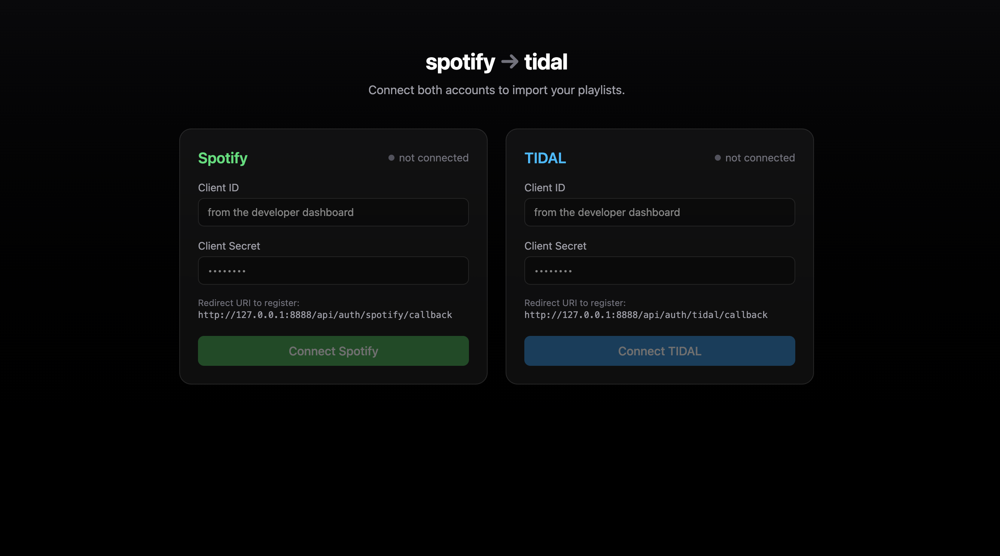
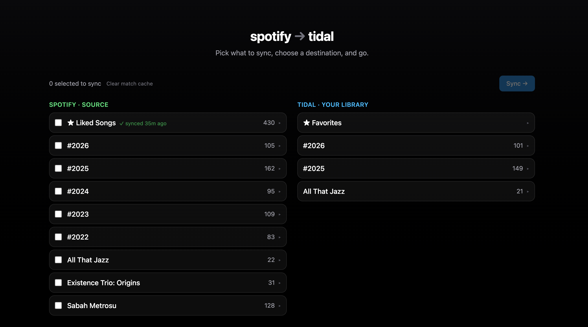
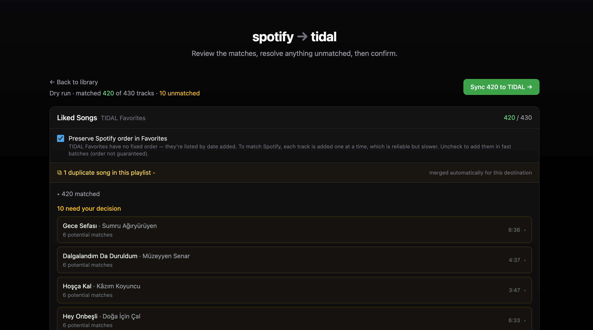
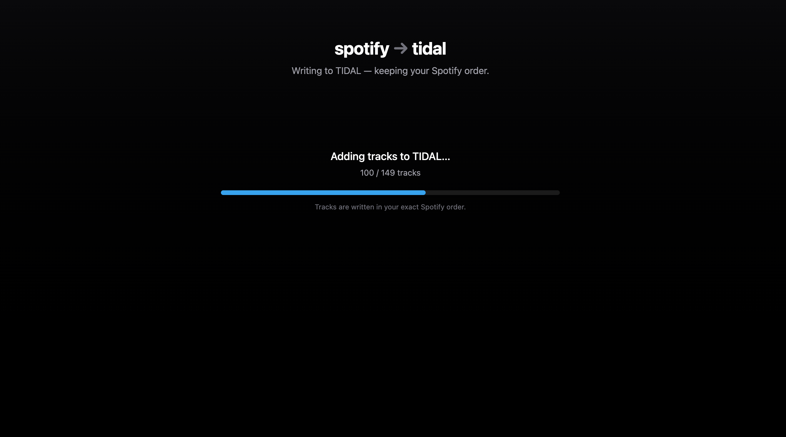

# spotify-tidal-sync

Move your Spotify playlists and Liked Songs to TIDAL through a **browser-only** web app — no server, no install. It matches each track to TIDAL (ISRC first, with a smart fallback), lets you review and fix anything before writing, and keeps your playlist order intact. Everything runs in your browser and talks straight to Spotify and TIDAL; your tokens never leave your machine.

## Screenshots

Connect both accounts with your own API credentials:



Browse your Spotify playlists and Liked Songs alongside your TIDAL library, and pick what to sync:



Review the matches before anything is written — resolve unmatched tracks, handle duplicates, and choose options like preserving order in Favorites:



Then sync, keeping your exact Spotify order:



## Getting started

**Requirements:** [Node.js](https://nodejs.org) ≥ 22 and [pnpm](https://pnpm.io) (to run/build), plus your own developer apps for [Spotify](https://developer.spotify.com/dashboard) and [TIDAL](https://developer.tidal.com).

The app uses the **Authorization Code + PKCE** flow, so register both as **public** clients — **no client secret is needed**. Set the redirect URI on each app to the URL where the app runs:

- Local dev: `http://127.0.0.1:5173/`
- If you deploy it: your site's origin, e.g. `https://your-app.example/`

Then run:

```bash
pnpm install
pnpm dev
```

This opens the app at <http://127.0.0.1:5173>. Paste each service's **Client ID** to connect, pick what to sync and where, review the matches, and confirm.

## Deploying

`pnpm build` produces a static site in `web/dist/` — host it on any static host. There's no backend to run, and nothing secret is baked into the build (users paste their own Client IDs at runtime). After deploying, register your site's origin `/` (e.g. `https://your-app.pages.dev/`) as a redirect URI on both apps. (`pnpm preview` serves the build locally.)

### Cloudflare

Cloudflare creates Git-connected projects as a Worker serving static assets. A [`wrangler.toml`](wrangler.toml) is included that points at the build output and enables SPA routing — no GitHub secrets and no deploy workflow to maintain.

In the dashboard, go to **Workers & Pages → Create application → Import a repository**, pick this repo, and set:

- **Build command:** `pnpm build`
- **Deploy command:** `npx wrangler deploy`
- **Variable** (under Advanced): `NODE_VERSION` = `22`

Cloudflare builds and deploys on every push to your production branch. Once deployed, add your site's URL — `https://<name>.<your-subdomain>.workers.dev/` or your custom domain — as a redirect URI on both the Spotify and TIDAL apps.

## Features

- **ISRC-first matching** with a fuzzy title/artist/duration fallback.
- **Review before writing** — resolve unmatched tracks by picking a suggestion or pasting a TIDAL link; nothing is written until you confirm.
- **Order preserved** — new playlists mirror the Spotify order exactly.
- **Flexible destinations** — a new TIDAL playlist, an existing one (append-only), or your TIDAL Favorites.
- **Duplicate handling**, **live progress**, a **match cache** for fast re-runs, and a **"last synced" badge** per playlist.

## Where your data lives

Everything stays in your **browser's `localStorage`** — your client IDs, OAuth tokens, and sync history. There is no server and no database; the app only ever talks to Spotify and TIDAL directly. Clearing your browser data (or using the in-app controls) removes it.

## Scripts

| Command | Description |
| --- | --- |
| `pnpm dev` | Run the app with hot reload |
| `pnpm build` | Type-check and build the static site |
| `pnpm preview` | Serve the production build locally |
| `pnpm test` | Run the unit tests |

## License

[PolyForm Noncommercial License 1.0.0](LICENSE) — free for any **noncommercial** use (personal, hobby, research, education, nonprofits). Commercial use is not permitted.
